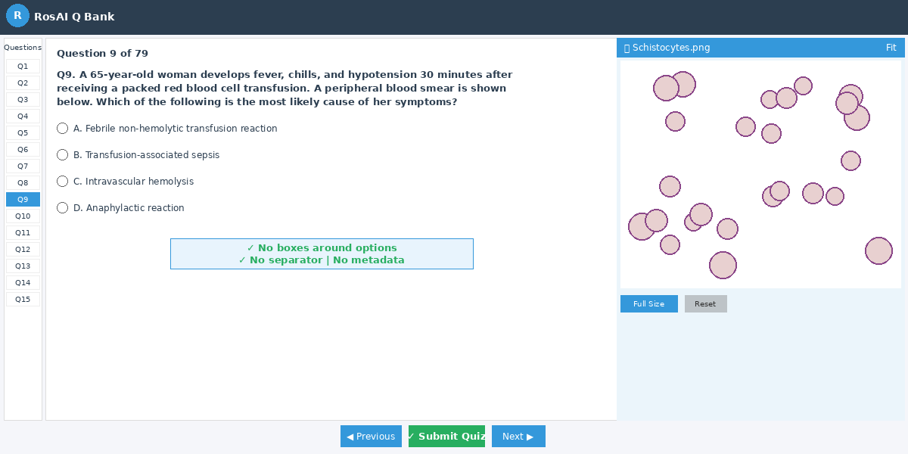
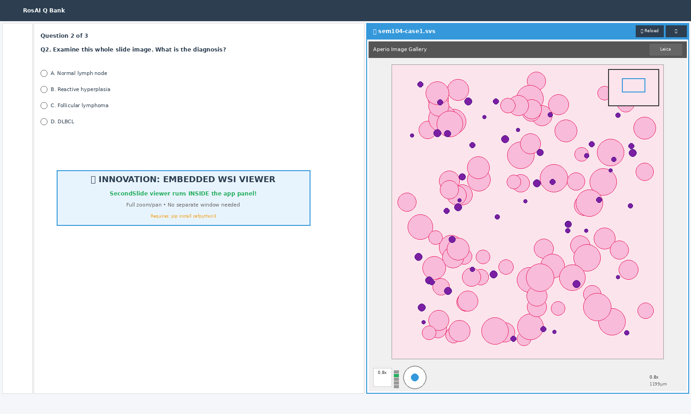
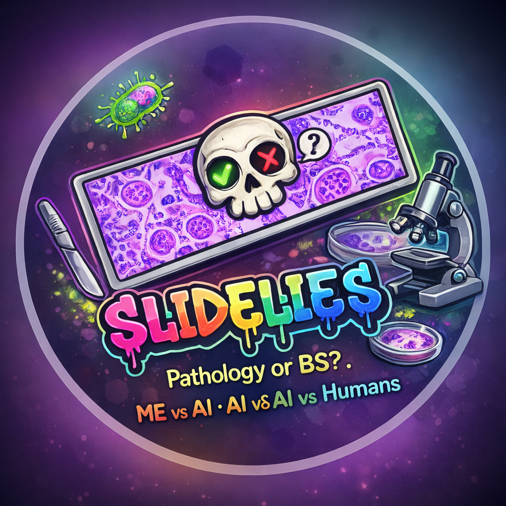
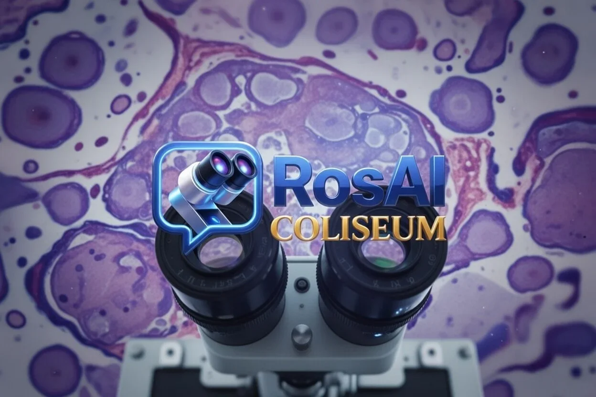

# RosAI Coliseum

**An AI-native pathology learning platform — quiz engine, hematopathology workspace, flow-cytometry analyzer, and adaptive AI tutoring in one desktop app.**

*A showcase repository — screenshots and overview. Source code is private (commercial product).*

---

> **Educational use only.** RosAI Coliseum is a study and teaching tool for pathology trainees. It is not a diagnostic device and is not for clinical decision-making.

## What it is

RosAI Coliseum is a desktop pathology-education platform I designed and built as a practicing physician. It combines a large adaptive question bank with AI-driven tutoring, a WHO-aligned hematopathology workspace, and interactive diagnostic games — the tools I wished existed during board preparation, built into one cohesive app.

The name is a nod to *Rosai & Ackerman*-era surgical pathology tradition, reimagined for an AI-assisted study workflow.

---

## See it in action

A 20-second tour of the platform — the splash, the modules, and the AI-assisted study flow.

***▶ Click to play — RosAI Coliseum overview (21s)***

---

## Contents

- [See it in action](#see-it-in-action)
- [Highlights](#highlights)
- [Feature tour](#feature-tour)
- [The learning loop](#the-learning-loop)
- [Tech stack](#tech-stack)
- [About the author](#about-the-author)

---

## Highlights

- 🧪 **Adaptive Q-Bank** — multi-layer questions with per-distractor reasoning
- 🤖 **AI Tutor & Image Analyzer** — Claude-powered explanations and image read-outs
- ☁️ **Study Cloud** — explanations tailored to *your specific* wrong answer, with a visual "misconception map"
- 🩸 **HemePath workspace** — WHO 5th-edition diagnostic worksheets across 130+ entities
- 📊 **Flow Cytometry Analyzer** — interactive dot-plot gating, marker atlas, and case library (B-ALL, CLL, AML, APL, FL, normal marrow)
- 🎭 **SlideLies game** — the AI describes a slide; you call *BS* or *Concur* — gamified pattern recognition
- ⌨️ **Command Palette (Ctrl+K)** — instant navigation across every module

---

## Feature tour

### Dashboard
A unified home for every study module.

### Quiz interface
Clean, distraction-free question layout with adaptive explanations.

### Whole-slide image integration
Embedded WSI viewing alongside questions for image-based reasoning.

And here it is running for real — the built-in viewer panning and zooming an Aperio whole-slide image right next to a live quiz question:

***▶ Click to play — built-in WSI viewer, live (44s)***

### SlideLies — diagnostic reasoning as a game
The AI generates a slide description; the learner decides whether it's accurate.

### Slide preview & question templating

---

## The learning loop

1. **Answer** an adaptive question or play a SlideLies round.
2. **Miss one?** Study Cloud generates an explanation targeted at the *specific* misconception behind your chosen distractor.
3. **See the pattern** — recurring errors surface as a visual misconception map.
4. **Go deeper** — jump to the HemePath workspace or Flow analyzer for the underlying entity.
5. **Repeat** — the bank adapts to what you keep getting wrong.

---

## Tech stack

- **PySide6 (Qt for Python)** — native cross-platform desktop UI
- **Claude API** — AI tutor, image analysis, adaptive explanations, SlideLies generation
- **Custom widgets** — flow-cytometry dot-plot gating, animated "study cloud" visualizations, WSI preview
- **Local-first data** — question banks, case libraries, and progress stored on-device

---

## About the author

Built by **Daniel Millian, MD** — a physician designing AI-assisted tools for pathology education. RosAI Coliseum represents the full arc: clinical domain expertise, product design, and hands-on engineering of a 24,000-line application.

*© 2026 Daniel Millian. All rights reserved. Screenshots shown for portfolio purposes.*

